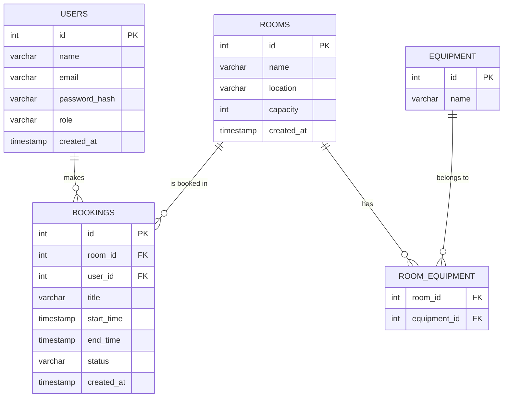

# รายงานสรุปผลการปฏิบัติงาน ประจำสัปดาห์ที่ 4
## โครงการ: Meeting Room Booking System

| รายการ | รายละเอียด |
|---|---|
| ชื่อ-นามสกุล | Tanakit (Handsome) |
| ตำแหน่ง | DevOps Intern |
| บริษัท | Nipa Cloud Service (NCS) |
| วันที่ | 30 มิถุนายน 2569 |

---

## 1. บทนำและวัตถุประสงค์

ในสัปดาห์นี้ได้รับมอบหมายให้พัฒนาและ deploy ระบบจองห้องประชุม (Meeting Room Booking System) แบบครบวงจร ตั้งแต่การออกแบบฐานข้อมูล เขียน Backend API จนถึงการ deploy บน Kubernetes cluster จริงผ่านแนวทาง GitOps โดยมีวัตถุประสงค์เพื่อ:

- ฝึกทักษะการพัฒนาแอปพลิเคชันแบบ Full-stack (Node.js + PostgreSQL)
- เข้าใจกระบวนการ Containerization ด้วย Docker
- ฝึกเขียน Helm Chart สำหรับ deploy บน Kubernetes
- ตั้งค่า CI/CD Pipeline แบบ GitOps ด้วย GitHub Actions และ ArgoCD
- ประยุกต์ใช้ความรู้ด้าน DevOps กับโปรเจกต์จริงตั้งแต่ต้นจนจบ

---

## 2. Tech Stack ที่ใช้งาน

| ส่วนงาน | เทคโนโลยี |
|---|---|
| Backend | Node.js (Express) + JWT Authentication |
| Database | PostgreSQL 16 |
| Frontend | React (Vite) — อยู่ระหว่างพัฒนา |
| Containerization | Docker + Docker Compose (local dev) |
| Orchestration | Kubernetes 3-node HA Cluster (k8s-node1/2/3) |
| Package Manager | Helm v4 |
| CI Pipeline | GitHub Actions |
| CD / GitOps | ArgoCD |
| Container Registry | Docker Hub (hamkwargs/booking-backend) |
| Storage | Cinder CSI (OpenStack) สำหรับ PostgreSQL PVC |
| Networking | Calico CNI + ingress-nginx |

---

## 3. สรุปงานที่ดำเนินการทั้งหมด

| Phase | สิ่งที่ทำ | รายละเอียดสำคัญ | สถานะ |
|---|---|---|---|
| 1 | Local Setup + Git Repository | สร้าง repo, ตั้ง .gitignore, push ขึ้น GitHub | ✅ เสร็จ |
| 2 | Database Schema Design | ออกแบบ 5 ตาราง + ER Diagram (Mermaid) | ✅ เสร็จ |
| 3 | Backend API Development | Express + JWT + race condition fix | ✅ เสร็จ |
| 4 | Dockerize Backend | Dockerfile + image 205MB + ทดสอบ local | ✅ เสร็จ |
| 5 | Push Image to Registry | Docker Hub: hamkwargs/booking-backend:v1 | ✅ เสร็จ |
| 6 | Helm Chart | Multi-environment: dev/staging/production | ✅ เสร็จ |
| 7 | ArgoCD Applications | 3 environments Synced + Healthy | ✅ เสร็จ |
| 8 | GitHub Actions CI/CD | build → push → update tag → ArgoCD sync | ✅ เสร็จ |
| 9 | Frontend (React) | อยู่ระหว่างพัฒนา | 🔄 กำลังทำ |

---

## 4. การออกแบบ Database Schema

ออกแบบ schema ตามหลัก Normalization โดยมี 5 ตารางหลัก แยก concern ได้ชัดเจน:

### 4.1 ตารางในระบบ

- **users** — เก็บข้อมูลผู้ใช้ (id, name, email, password_hash, role, created_at)
- **rooms** — ข้อมูลห้องประชุม (id, name, location, capacity, created_at)
- **equipment** — รายการอุปกรณ์ (id, name)
- **room_equipment** — junction table เชื่อม rooms กับ equipment แบบ many-to-many
- **bookings** — ข้อมูลการจอง (id, room_id, user_id, title, start_time, end_time, status, created_at)

### 4.2 ER Diagram



### 4.3 Design Decisions สำคัญ

- **ไม่เก็บ `is_available`** ใน rooms เพราะ "ว่าง/ไม่ว่าง" ขึ้นกับช่วงเวลา ควร derive จาก bookings table แบบ real-time แทน (prevent stale data)
- **ใช้ `status = cancelled`** แทนการลบ row เพื่อเก็บ audit trail การจองทั้งหมด
- **CHECK constraint** `(end_time > start_time)` ระดับ DB กัน time range ผิดพลาด
- **Partial Index** บน bookings `WHERE status = 'confirmed'` เพิ่มประสิทธิภาพการ query เช็ค conflict

---

## 5. Backend API

พัฒนาด้วย Node.js (Express) มี 9 endpoints หลัก:

| Method | Path | Auth | คำอธิบาย |
|---|---|---|---|
| POST | `/api/auth/register` | Public | สมัครสมาชิก พร้อม JWT token |
| POST | `/api/auth/login` | Public | เข้าสู่ระบบ รับ JWT token |
| GET | `/api/rooms` | User | ดูรายการห้องประชุม + อุปกรณ์ |
| POST | `/api/rooms` | Admin | เพิ่มห้องประชุมใหม่ |
| DELETE | `/api/rooms/:id` | Admin | ลบห้องประชุม |
| GET | `/api/bookings` | User | ดูประวัติการจองของตัวเอง |
| POST | `/api/bookings` | User | จองห้อง (เช็ค conflict อัตโนมัติ) |
| PATCH | `/api/bookings/:id/cancel` | User | ยกเลิกการจอง |
| GET | `/health/live`, `/health/ready` | Public | k8s liveness/readiness probe |

### 5.1 Booking Conflict Detection

ใช้ SQL Overlap Detection Formula มาตรฐานที่ครอบคลุมทุกกรณีการซ้อนทับ:

```sql
WHERE room_id = $1
  AND status = 'confirmed'
  AND start_time < $3   -- existing เริ่มก่อน new จบ
  AND end_time > $2     -- existing จบหลัง new เริ่ม
```

### 5.2 Race Condition Prevention

ใช้ PostgreSQL Row-Level Lock (`SELECT ... FOR UPDATE`) ใน Transaction เพื่อป้องกันกรณีที่ 2 users จองห้องเดียวกันพร้อมกัน:

```javascript
await client.query('BEGIN');
// Lock แถวของห้องนี้ไว้ก่อน
await client.query('SELECT id FROM rooms WHERE id = $1 FOR UPDATE', [room_id]);
// เช็ค conflict ด้วย data ล่าสุด
// INSERT booking
await client.query('COMMIT');
```

### 5.3 Security Best Practices

- **JWT Authentication** — ทุก endpoint ที่ต้อง login มี middleware `authenticate` คั่นก่อน
- **bcrypt** — hash password ก่อนเก็บเสมอ ไม่เก็บ plain text
- **Parameterized Query** — ป้องกัน SQL Injection ทุก query
- **Generic Error Message** — login ตอบ error เดิมทั้งกรณี email ไม่มีและ password ผิด กัน user enumeration attack

---

## 6. Containerization ด้วย Docker

### 6.1 Dockerfile

```dockerfile
FROM node:20-alpine
WORKDIR /app
COPY package*.json ./
RUN npm install --production
COPY src ./src
COPY db ./db
EXPOSE 3000
CMD ["node", "src/server.js"]
```

**Design Decisions:**
- `node:20-alpine` — base image เล็ก (~5MB) ได้ final image 205MB (เทียบกับ Spring Boot 487MB)
- COPY `package*.json` ก่อน `npm install` ก่อน COPY source — **Layer Caching Optimization** กัน npm install ซ้ำทุกครั้งที่แก้โค้ด
- `--production` — ข้าม devDependencies (เช่น nodemon) ลด size และ attack surface

### 6.2 Health Check Endpoints

| Endpoint | วัตถุประสงค์ | k8s Probe |
|---|---|---|
| `/health/live` | ตรวจว่า process ยังตอบสนอง | livenessProbe |
| `/health/ready` | ตรวจว่าต่อ DB ได้จริง | readinessProbe |

ถ้า DB ล่ม pod จะถูกถอดออกจาก Service endpoint อัตโนมัติโดยไม่ต้อง restart

---

## 7. Helm Chart

### 7.1 โครงสร้าง

```
helm-chart/
├── Chart.yaml
├── values.yaml
├── values-staging.yaml
├── values-production.yaml
└── templates/
    ├── _helpers.tpl
    ├── deployment.yaml
    ├── service.yaml
    ├── ingress.yaml
    ├── configmap.yaml
    ├── secret.yaml
    └── postgres-deployment.yaml
```

### 7.2 Multi-Environment Configuration

| Environment | Values Files | Replicas | Ingress Host |
|---|---|---|---|
| Development | values.yaml | 1 | booking.local |
| Staging | values.yaml + values-staging.yaml | 1 | booking-staging.local |
| Production | values.yaml + values-production.yaml | 2 | booking.prod.local |

### 7.3 ปัญหาที่พบและวิธีแก้

- **PVC Pending:** เพิ่ม `storageClassName: cinder-sc` เพื่อใช้ Cinder CSI ของ OpenStack
- **PostgreSQL mount error:** เพิ่ม `PGDATA=/var/lib/postgresql/data/pgdata` แก้ปัญหา `lost+found` directory บน Cinder volume

---

## 8. CI/CD Pipeline

### 8.1 GitHub Actions Workflow

Trigger: ทุกครั้งที่ push ขึ้น `main` branch

```
push to main
    │
    ▼
Checkout code
    │
    ▼
Login to Docker Hub
    │
    ▼
Build & Push image
hamkwargs/booking-backend:<commit-sha>
hamkwargs/booking-backend:latest
    │
    ▼
sed แก้ image tag ใน values.yaml
    │
    ▼
git commit & push values.yaml
    │
    ▼
ArgoCD ตรวจเจอ → sync อัตโนมัติ
```

### 8.2 ArgoCD GitOps

- สร้าง ArgoCD Application 3 ตัวแยกตาม environment
- sync policy: automated พร้อม self-heal และ prune
- ผลลัพธ์: แค่ `git push` โค้ด ทุก environment อัปเดต image ใหม่เองอัตโนมัติ

### 8.3 ปัญหาที่พบและวิธีแก้

**ArgoCD ApplicationSet Controller CrashLoopBackOff:**
- สาเหตุ: CRD `applicationsets.argoproj.io` มี annotation เกิน 256KB limit ของ Kubernetes
- แก้ด้วย: `kubectl apply --server-side --force-conflicts`

---

## 9. ปัญหาที่พบระหว่างปฏิบัติงาน

### 9.1 Security Incident — Cryptominer บน WordPress Container

ระหว่างการ debug k8s cluster บนเครื่อง `ubuntu-2404-ham` พบ log ที่น่าสงสัยใน `dmesg`:

```
Out of memory: Killed process 160877 (xmrig) total-vm:2448084kB
cpuset=docker-a2fc18a02544...scope
```

**สาเหตุ:** container WordPress ที่รันมา 3 สัปดาห์ถูกแฮ็กผ่านช่องโหว่ ทำให้ `xmrig` (Monero cryptocurrency miner) รันอยู่ภายใน container ใช้ RAM จนทำให้ etcd ถูก OOM-kill และ k8s cluster ล่มทั้งระบบ

**การแก้ไข:** หยุดและลบ `wordpress-app` container ออกจากระบบทันที

**บทเรียน:**
- ควร update WordPress และ plugin สม่ำเสมอ
- จำกัด resource ของ container ด้วย `resources.limits`
- Monitor CPU/Memory usage ที่ผิดปกติเป็นประจำ
- Container ที่ expose port สู่ภายนอกต้องผ่านการ security review

---

## 10. สรุปผลและแผนงานสัปดาห์ถัดไป

### 10.1 สิ่งที่สำเร็จในสัปดาห์นี้

- ✅ พัฒนา Backend API ครบทุก endpoint พร้อม security best practices
- ✅ Dockerize application ได้ image ขนาด 205MB ด้วย layer caching optimization
- ✅ Deploy บน Kubernetes 3-node cluster จริงผ่าน Helm Chart
- ✅ ตั้งค่า CI/CD Pipeline แบบ GitOps สมบูรณ์ — push code → deploy อัตโนมัติทุก environment
- ✅ แก้ปัญหา Security Incident (Cryptominer)

### 10.2 แผนงานสัปดาห์ถัดไป

- พัฒนา Frontend ด้วย React (Vite) — หน้า Login, รายการห้อง, จองห้อง, ประวัติการจอง
- Dockerize Frontend และเพิ่มเข้า Helm Chart
- สร้าง Kubernetes Job สำหรับรัน database migration อัตโนมัติตอน deploy
- ทดสอบ ArgoCD self-heal และ sync policy อย่างละเอียด

---

*Nipa Cloud Service (NCS) · DevOps Internship · Tanakit (Handsome) · 2569*